# JANJI
Saya Muhammad Dzaka Indrianto dengan NIM 2508755 mengerjakan Tugas Praktikum 1 dalam mata kuliah Desain dan Pemrograman Berorientasi Objek untuk keberkahanNya maka saya tidak melakukan kecurangan seperti yang telah dispesifikasikan. Aamiin.

# Struktur Program
```text
Main/
├── Dokumentasi/
│   ├── cpp/
│   │   ├── base.png
│   │   ├── erorhandlinginputharga.png
│   │   ├── erorhandlinginputmerk.png
│   │   ├── erorhandlinginputtahun.png
│   │   ├── erorhandlingjumlahdata.png
│   │   └── hasilinput.png
│   ├── java/
│   │   ├── base.png
│   │   ├── erorhandlinginputharga.png
│   │   ├── erorhandlinginputmerk.png
│   │   ├── erorhandlinginputtahun.png
│   │   ├── erorhandlingjumlahdata.png
│   │   └── hasilinput.png
│   ├── php/
│   │   ├── base.png
│   │   ├── erorhandlingharga.png
│   │   ├── erorhandlingmerk.png
│   │   ├── erorhandlingtahun.png
│   │   └── hasilinput.png
│   ├── python/
│   │   ├── base.png
│   │   ├── erorhandlinginputharga.png
│   │   ├── erorhandlinginputmerk.png
│   │   ├── erorhandlinginputtahun.png
│   │   ├── erorhandlingjumlahdata.png
│   │   └── hasilinput.png
│   └── desaindiagram.png
│
├── cpp/
│   ├── Hardware.cpp
│   ├── Laptop.cpp
│   ├── Main.cpp
│   └── ProdukIT.cpp
│
├── java/
│   ├── Hardware.java
│   ├── Laptop.java
│   ├── Main.java
│   └── ProdukIT.java
│
├── php/
│   ├── img/
│   │   ├── acer.png
│   │   ├── apple.png
│   │   ├── asus.png
│   │   ├── dell.png
│   │   ├── hp.png
│   │   └── lenovo.png
│   ├── Hardware.php
│   ├── Laptop.php
│   ├── main.php
│   └── ProdukIT.php
│
├── python/
│   ├── Hardware.py
│   ├── Laptop.py
│   ├── main.py
│   └── ProdukIT.py
│
├── input.txt
└── README.md
```

# Desain Relasi
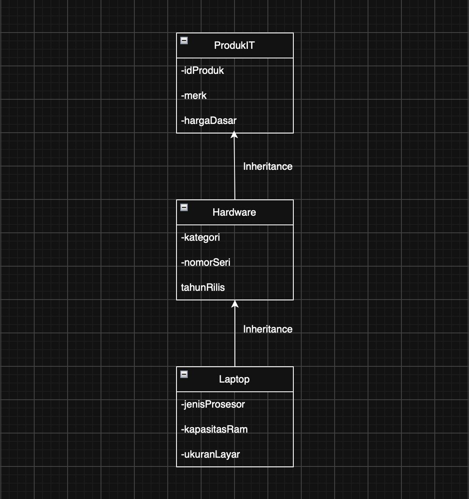

## Penjelasan Desain

1. **`ProdukIT` (Base Class / Level 1)**
   Berperan sebagai super-kelas tertinggi yang menyimpan properti identitas produk secara universal.
   *   `idProduk` (String): Kode unik produk.
   *   `merk` (String): Nama manufaktur atau *brand*.
   *   `hargaDasar` (Long Integer): Menggunakan tipe data `long long` (C++) dan `long` (Java) untuk menampung batas komputasi angka ekstrem (triliunan/kuadriliunan) guna menghindari *Integer Overflow*.

2. **`Hardware` (Intermediary Class / Level 2)**
   Mewarisi `ProdukIT` dan menspesifikasikan produk ke dalam bentuk perangkat keras fisik.
   *   `kategori` (String): Jenis perangkat keras (Laptop, PC, dll).
   *   `nomorSeri` (String): Nomor seri perangkat keras produksi.
   *   `tahunRilis` (Integer): Tahun peluncuran perangkat.

3. **`Laptop` (Derived Class / Level 3)**
   Mewarisi `Hardware` dan merupakan entitas paling spesifik dalam hierarki sistem ini.
   *   `jenisProsesor` (String): Spesifikasi CPU.
   *   `kapasitasRam` (String): Besaran memori komputasi sementara.
   *   `ukuranLayar` (String): Dimensi layar komputasi.
   *   **Optimasi Alur (Hardcoding State):** Pada konstruktor kelas ini, nilai untuk parameter *kategori* langsung di-*hardcode* dengan *string* `"Laptop"` menuju kelas induk. Hal ini memastikan konsistensi data dan meningkatkan pengalaman pengguna agar tidak perlu memasukkan data "kategori" yang sudah pasti berstatus Laptop secara berulang kali.

# Eror Handling
!Bagian ukuran layar bisa memasukkan input berupa karkater untuk mengantisipasi kalo input bukan inch!

## Java, C++, dan Python (CLI)
Pada program berbasis *Command Line Interface*, validasi mencegah karakter anomali masuk ke dalam memori. Jika terjadi pelanggaran, program akan membersihkan antrean input (*buffer flush*), menahan eksekusi di baris yang sama, dan mencetak peringatan berikut:
*   **Jumlah Data**: Menolak input karakter huruf pada deklarasi batas *loop*.
    > `(Error: Menolak huruf pada variabel integer)`
*   **Atribut Merk**: Mengevaluasi *string*, menolak jika seluruh input berisi angka (contoh: "12345").
    > `(Error: Menolak angka murni pada atribut merk)`
*   **Atribut Harga**: Mengamankan variabel `long` dari karakter huruf.
    > `(Error: Menolak kehadiran huruf pada harga)`
*   **Atribut Tahun**: Mengamankan variabel integer komputasi tahun dari karakter huruf.
    > `(Error: Menolak kehadiran huruf pada tahun)`

## PHP (Web Form)
Validasi berbasis web dilakukan melalui *Server-Side Validation*. Form akan dievaluasi ketat sebelum direkam ke dalam `$_SESSION`.
*   Sistem menggunakan utilitas `is_numeric()` untuk mencegah perembesan tipe karakter pada atribut **Harga** dan **Tahun**. Logika terbalik diterapkan pada atribut **Merk** untuk memastikan form ditolak jika dikirim menggunakan angka murni.
*   Pesan peringatan akan muncul secara dinamis di atas antarmuka form.
*   **Persistensi Data Dummy:** 5 data *hardcode* awal dipisahkan dari penyimpanan `$_SESSION` dan disatukan kembali secara dinamis menggunakan `array_merge()` saat merender tabel. Teknik ini menjamin data dasar akan terus muncul secara persisten tanpa terpengaruh kondisi kerusakan sesi atau *cache browser*.

# Dokumentasi

## Java, C++, dan Python
Berikut adalah dokumentasi pengujian tabel dinamis dan validasi input yang menyimulasikan sistem *Error Handling* pada lingkungan CLI:

1. **Kondisi Awal (Base Data)**
   <br>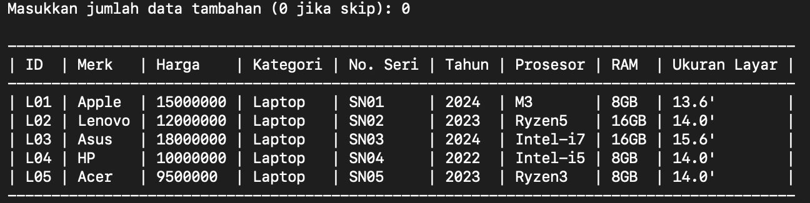
2. **Error Handling: Jumlah Data**
   <br>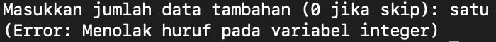
3. **Error Handling: Merk (Angka Murni)**
   <br>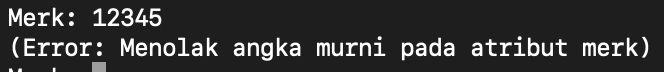
4. **Error Handling: Harga (Mengandung Huruf)**
   <br>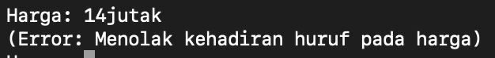
5. **Error Handling: Tahun (Mengandung Huruf)**
   <br>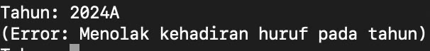
6. **Hasil Input Data Baru (Tabel Dinamis)**
   <br>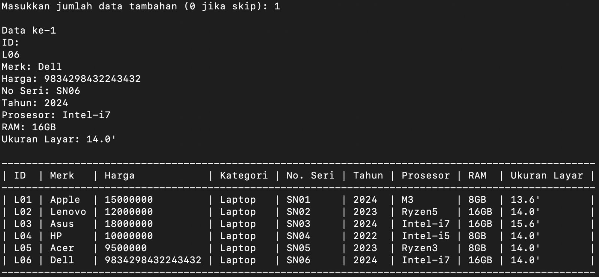

## PHP
Berikut adalah dokumentasi pengujian simulasi *Error Handling* dan pencetakan data secara asinkron pada antarmuka Web HTML/PHP:

1. **Kondisi Awal (Base Data)**
   <br>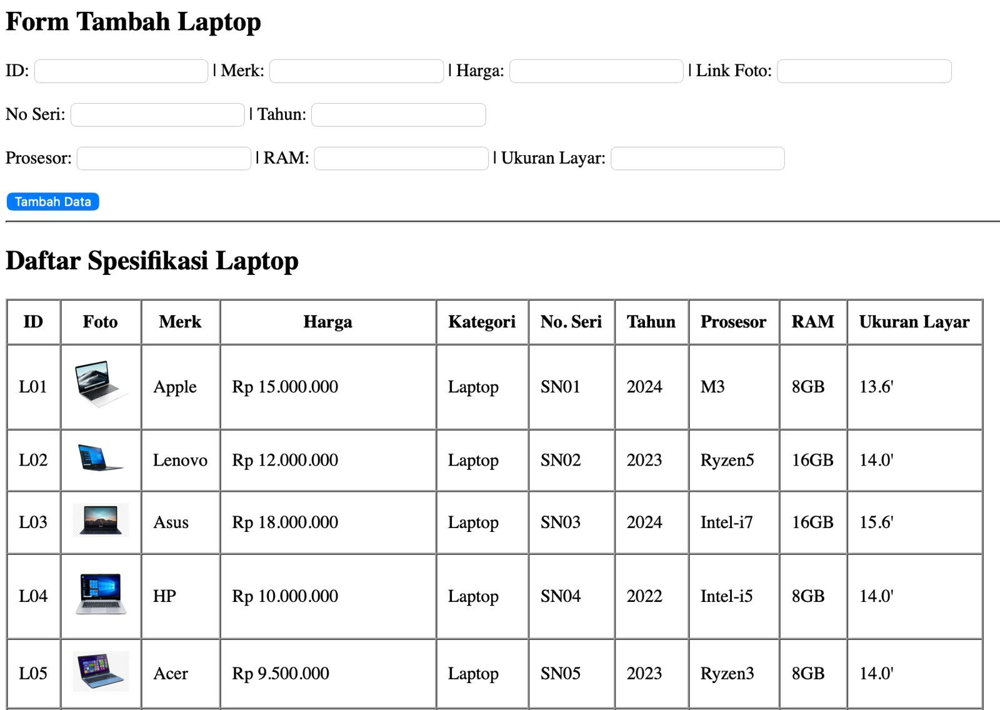
2. **Error Handling: Merk (Angka Murni)**
   <br>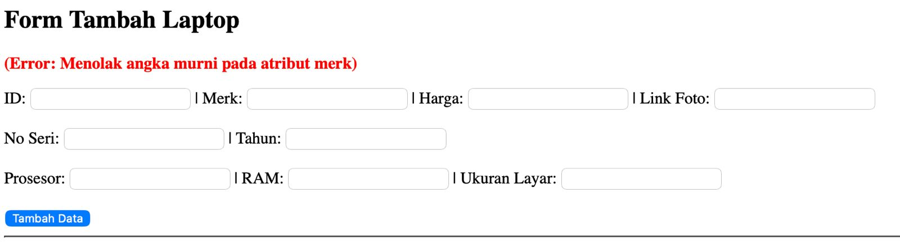
3. **Error Handling: Harga (Mengandung Huruf)**
   <br>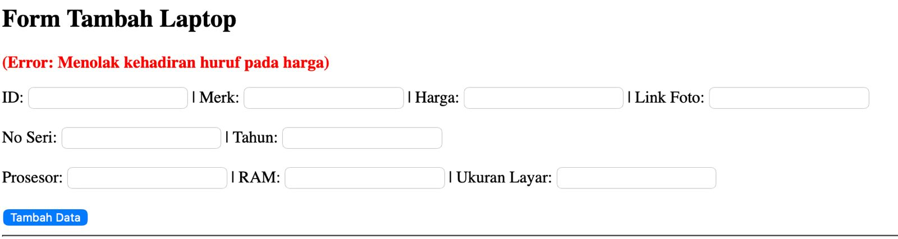
4. **Error Handling: Tahun (Mengandung Huruf)**
   <br>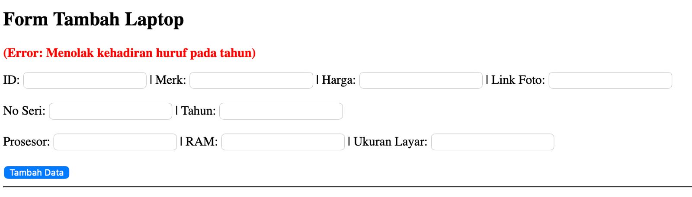
5. **Hasil Input Data Baru (Tabel Dinamis)**
   <br>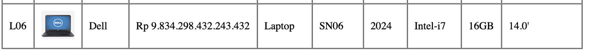
